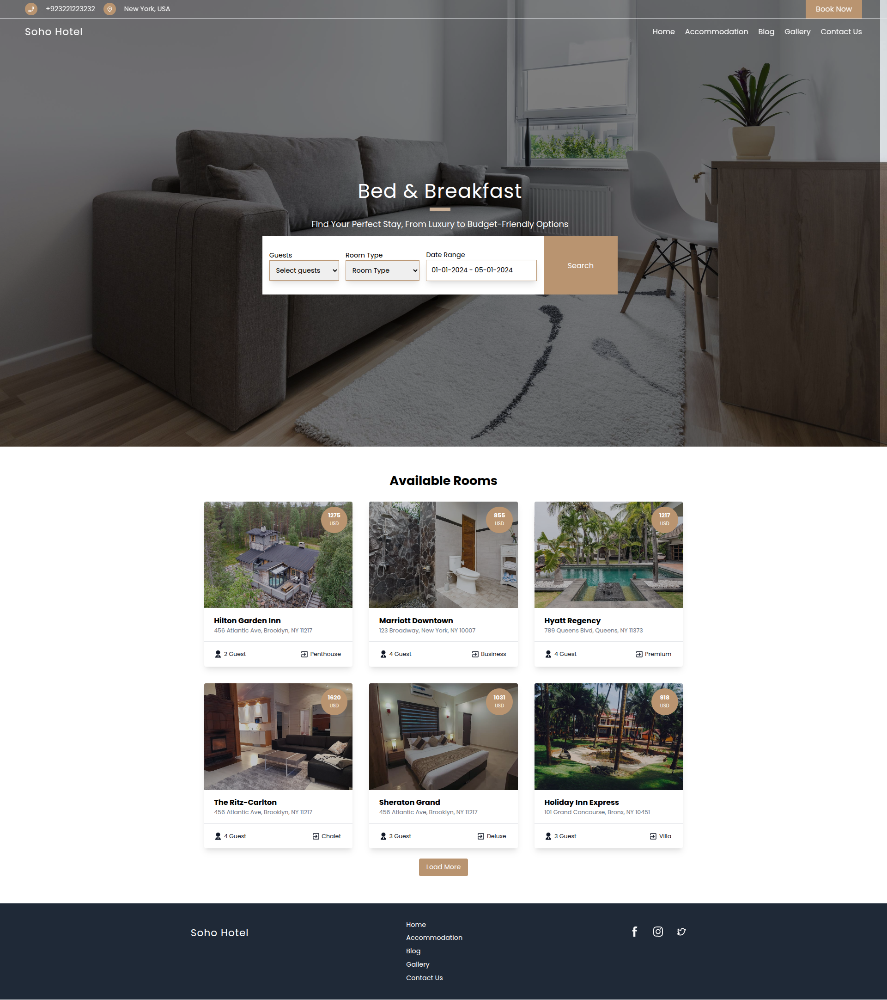
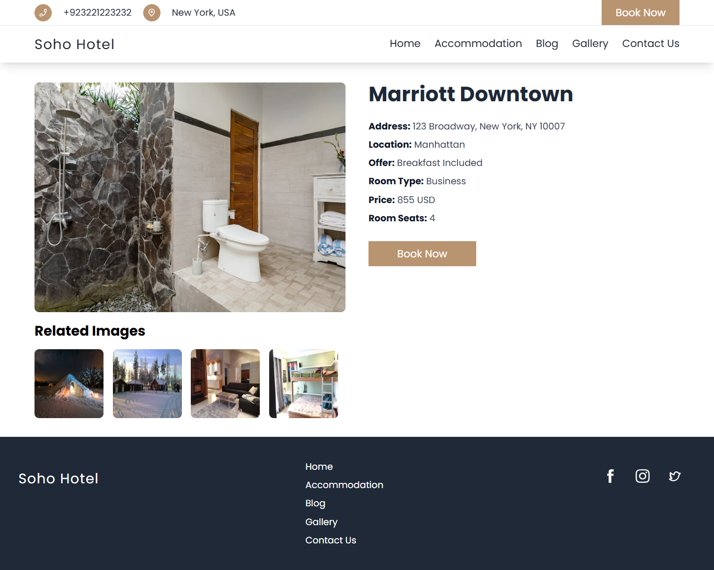
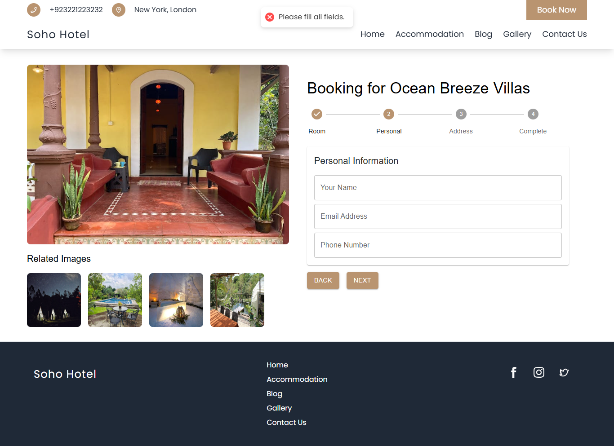

# Soho Hotel - Hotel Booking Website

Soho Hotel is a hotel booking website designed to support diverse booking scenarios. Users can book a hotel by filling in booking details such as name, email, phone, address, hotel choice, room type, and pricing. This website ensures a seamless and flexible booking experience.

---

## Table of Contents
1. [UI Screenshots](#ui-screenshots)
2. [Getting Started](#getting-started)
   - [Prerequisites](#prerequisites)
3. [Run with Docker](#run-with-docker)
4. [Key Commands Reference](#key-commands-reference)
   - [Without Docker Compose](#without-docker-compose)
5. [Features](#features)
6. [Booking Workflow](#booking-workflow)
7. [Additional Information](#additional-information)
   - [Booking Details](#booking-details)
   - [Booking Results](#booking-results)
   - [Time Frozen Information](#time-frozen-information)
8. [Deployment](#deployment)
9. [Run Prompt Generation Script](#run-prompt-generation-script)
10. [Usage](#usage)
11. [Testing](#testing)

---

## UI Screenshots

### Room Listing Page


### Room Details Page


### Booking Page


---

## Project Overview

The main goal of the Soho Hotel website is to provide a seamless booking experience for users. Here's how the booking flow works:

1. Users browse available hotels and rooms on the website.
2. They select a hotel, choose a room type, and enter booking details (name, email, phone, address, etc.).
3. Users review the summary of their booking, including pricing and other details.
4. Upon confirmation, the booking is saved, and the user receives a confirmation.

## Features

1. **User-Friendly Booking Process**: Simplified hotel booking with an intuitive interface.  
2. **Flexible Room Selection**: Browse and choose from various room types and amenities.  
3. **Real-Time Data Handling**: Dynamically captures and stores booking details.  
4. **Customizable Booking Options**: Filter hotels based on preferences like room type and location.  
5. **Responsive Design**: Fully optimized for desktops, tablets, and mobile devices.  
6. **Docker Support**: Quick setup and deployment using Docker and Docker Compose.  
7. **Prompt Generation Script**: Generates custom booking scenarios for testing.  
8. **Error-Free Workflow**: Validates user inputs to ensure accurate bookings.  
9. **Live Booking Tracking**: Tracks live booking data in the browser console.  
10. **Built-In Discounts**: Displays dynamic pricing with discounts and final cost.  
11. **Secure Payment Options**: Supports detailed payment information with pay-later features.  
12. **Room and Hotel Ratings**: Shows hotel ratings and additional booking details.  

---

## **Tech Stack**

- **Frontend**: React.js
- **State Management**: Local Storage APIs
- **Styling**: Tailwind CSS
- **Backend Simulation**: JSON data

---

## **Project Setup and Installation**

### **Steps to Run Locally**

1. **Clone the Repository**:
   ```bash
   git clone https://github.com/Wombat-Offline-Website/soho-hotel.git
   ```
2. **Navigate to the Project Directory**:
   ```bash
   cd soho-hotel
   ```
3. **Install Dependencies**:
   ```bash
   npm install
   ```
4. **Run the Application**:
   ```bash
   npm start
   ```

---

## **Working with Docker**

### **Docker Intallation**

- Install docker from [Docker](https://www.docker.com/products/docker-desktop/)

### **Build and Run Without Docker Compose**

1. **Build the Docker Image**:
   ```bash
   docker buildx build --platform=linux/amd64 -f ./Dockerfile -t soho-hotel . --load
   ```

2. **Run the Docker Container**:
   ```bash
   docker run -p 3000:80 soho-hotel
   ```

3. **Access the Application**:
   Open your browser and go to [http://localhost:3000](http://localhost:3000).

4. **Check the Running Container**:
   ```bash
   docker ps
   ```

5. **Stop the Container**:
   ```bash
   docker stop <container_id>
   ```

6. **Remove the Container**:
   ```bash
   docker rm <container_id>
   ```

---

## Additional Information

### Booking Details

Users can provide the following information during booking:
- **Name**: The user's full name.
- **Email**: The user's email address.
- **Phone**: The user's phone number.
- **Street**: Street address for billing or reservation.
- **City**: City for the user’s stay.
- **Zip**: Zip code for the location.
- **Hotel**: Hotel choice for the booking.
- **Room Type**: The type of room selected (e.g., Luxury, Suite).
- **Price**: The total price of the booking.

### Notes on Frozen Date and Time

The application is frozen in time `check_in_date`:`01-01-2024` to `check_out_date`:`05-01-2024`. Any selected date reflects this baseline for consistent testing and demonstration. 

The application stores this information in `window.currentBookingInfo`.

---
### **window.currentBookingInfo**

Tracks active booking data dynamically. Example structure:
```json
{
    "bookingDetails": {
        "check_in_date": "01-01-2024",
        "check_out_date": "05-01-2024",
        "roomType": "",
        "guest": "",
        "hotel": {
            "id": "",
            "name": "",
            "roomType": "",
            "address": "",
            "offer": "",
            "price": "",
            "discount": "",
            "serviceFee": ""
        }
    },
    "userDetails": {
        "name": "",
        "email": "",
        "phone": ""
    },
    "paymentDetails": {
        "price": "",
        "discount": "",
        "priceAfterDiscount": ""
    },
    "isFinalPage": false
}
```

### **window.bookingResults**

Stores completed booking history for reference. Example structure:


```json
[
   {
    "bookingDetails": {
        "booking_id": "ee34476d-a194-42f7-124-d574b1915545",
        "check_in_date": "05-01-2025",
        "check_out_date": "11-01-2025",
        "guest": 3,
        "roomType": "Dormitory",
        "hotel": {
            "id": 124,
            "name": "The Ritz-Carlton",
            "address": "404 8th Ave, New York, NY 10001",
            "price": 1831,
            "offer": "Breakfast Included",
            "discount": 20,
            "serviceFee": 220
        }
    },
    "paymentDetails": {
        "price": "1831",
        "discount": "20",
        "priceAfterDiscount": "1811"
    },
    "userDetails": {
        "name": "Charlotte Clark",
        "email": "user6622@mail.com",
        "phone": "1164597669"
    }
}
]
```

## Deployment

Use Docker to deploy the application by following the steps outlined in the Docker section.

---

## **Run Prompt Generation Script**

### **Setting Up a Virtual Environment**

1. **Navigate to the Project Directory**:
   ```bash
   cd soho-hotel
   ```

2. **Create a Virtual Environment**:
   ```bash
   python -m venv venv
   ```

3. **Activate the Virtual Environment**:
   - **Windows**:
     ```bash
     venv\Scripts\activate
     ```
   - **macOS/Linux**:
     ```bash
     source venv/bin/activate
     ```

4. **Run the Script**:
   ```bash
   python generate_prompts.py -n 20 -o booking_prompts.json
   ```

5. **Deactivate the Virtual Environment**:
   ```bash
   deactivate
   ```

### Generate Booking Prompts
Use the script to generate random sample prompts:
```bash
python generate_prompts.py -n 20 -o generated_results.json
```
- `-n`: Number of prompts to generate.
- `-o`: Output file name.

#### **Example Generated Result**

```json
[
    {
        "prompt": "I want to confirm a booking for a Dormitory room at The Ritz-Carlton in Chelsea, at 404 8th Ave, New York, NY 10001. It's for 3 people from January 05, 2025 to January 11, 2025. My contact details are Charlotte Clark, 1164597669, user6622@mail.com.",
        "bookingDetails": {
            "booking_id": "ee34476d-a194-42f7-124-d574b1915545",
            "check_in_date": "05-01-2025",
            "check_out_date": "11-01-2025",
            "guest": 3,
            "roomType": "Dormitory",
            "hotel": {
                "id": 124,
                "name": "The Ritz-Carlton",
                "address": "404 8th Ave, New York, NY 10001",
                "price": 1831,
                "offer": "Breakfast Included",
                "discount": 20,
                "serviceFee": 220
            },
            "paymentDetails": {
                "price": "1831",
                "discount": "20",
                "priceAfterDiscount": "1811"
            },
            "userDetails": {
                "name": "Charlotte Clark",
                "email": "user6622@mail.com",
                "phone": "1164597669"
            }
        }
    }
]

```

---

## Usage

### Booking a Room
1. Select a hotel and room type.
2. Enter booking details and confirm.
3. Check `window.bookingResults` for completed bookings.

---

## Testing

To test the booking flow:
- Check `window.currentBookingInfo` in the browser console for live booking details.
- Inspect `window.bookingResults` for completed bookings.

---
